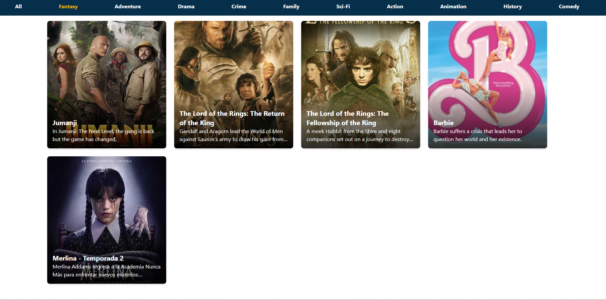

# Movies App 🎬🎥


Aplicación web interactiva para explorar un catálogo de películas por categorías. Desarrollada como proyecto práctico para poner a prueba las herramientas de navegación y enrutamiento dinámico que ofrece **React Router**.

---

## 🎯 Características y Uso de React Router

* **Navegación declarativa (`Link`):** Transiciones entre secciones sin recargar la página.
* **Estructura persistente (`Outlet`):** Un diseño base con Navbar persistente donde se renderiza el contenido según la ruta.
* **Filtrado dinámico (`useSearchParams`):** Manejo de parámetros en la URL (`?genres=...`) para filtrar el listado de películas en tiempo real.

---

## 📸 Vista Previa



---

## 🗺️ Vistas y Rutas

| Ruta | Descripción |
| :--- | :--- |
| `/` | Catálogo completo con todas las películas disponibles. |
| `/?genres={genre}` | Catálogo de películas filtradas según la categoría seleccionada. |

---

## 🛠️ Tecnologías Utilizadas

* [React](https://react.dev/) `v19.2` — Biblioteca para interfaces de usuario.
* [Vite](https://vite.dev/) `v8.1` — Empaquetador y servidor de desarrollo.
* [Tailwind CSS](https://tailwindcss.com/) `v4.3` — Framework de estilos utilitarios.
* [React Router](https://reactrouter.com/) `v8.3` — Gestión de rutas y navegación.
* [Devs ApiHub - Movies](https://devsapihub.com/docs/api-movies) — API REST para consultar la colección de películas.

---

## 🚀 Instalación y Configuración Local

### Prerrequisitos
Asegúrate de tener instalado [Node.js](https://nodejs.org/) (versión 18 o superior).

### Pasos

1. **Clonar el repositorio:**
   ```bash
   git clone [https://github.com/tu-usuario/movies.git](https://github.com/tu-usuario/movies.git)
   cd movies

2. **Instalar dependencias**
    ```bash
    npm install

3. **Iniciar servidor de desarrollo**
    ```bash
    npm run dev